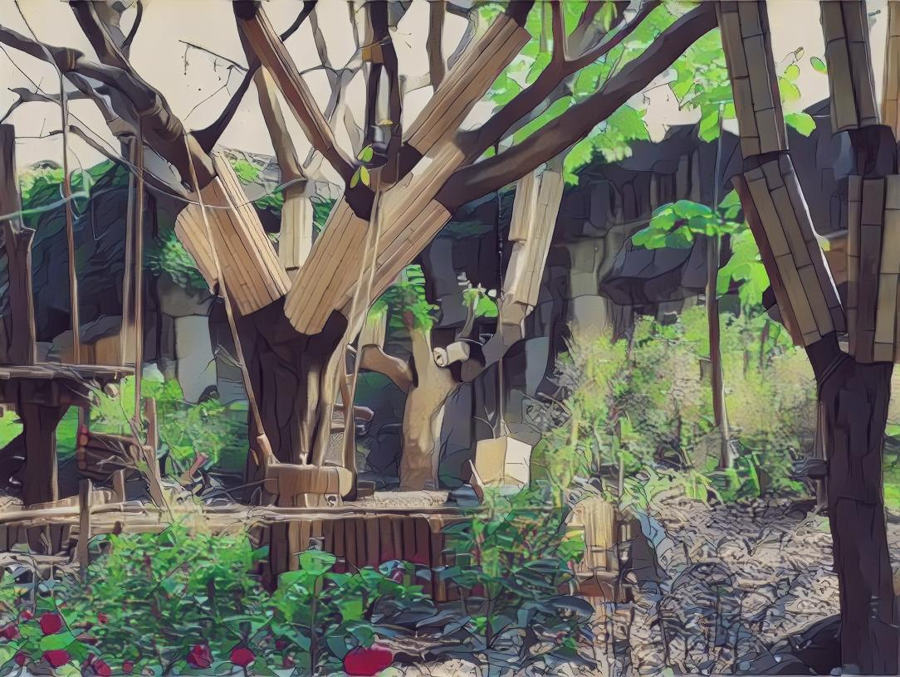
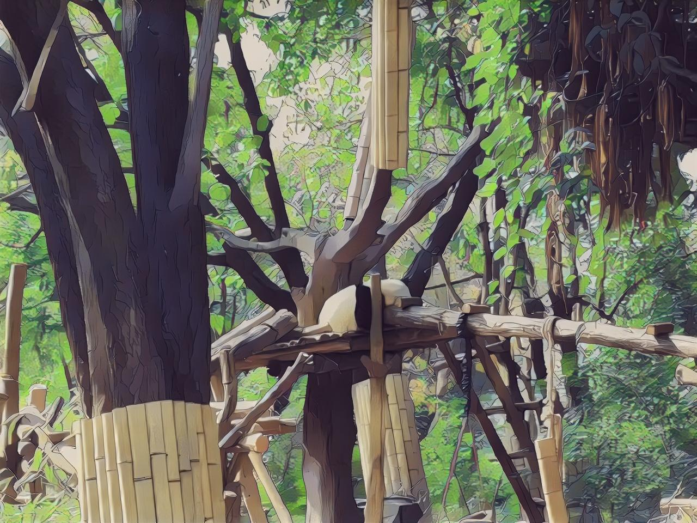

# 介绍

这里是基于Paddle实现的AnimeGANv2推理代码，训练网络可参考:https://github.com/PaddlePaddle/PaddleGAN/blob/develop/docs/zh_CN/tutorials/animegan.md ,将训练好的权重移动到该目录下，修改加载权重的代码即可运行。

# 效果:

# ps:

由于只在ai studio上训练了50个epoch，所以对某些图像的局部细节处理不是很好，考虑后续更新一个更好的权重文件